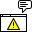

#  Notification Attention

"Draws attention" to windows which display a notification.

This extension is based on freaktechnik's [Notification Sound](https://github.com/freaktechnik/notification-sounds) extension.

## Mechanism

Overrides Website's `Notification` constructor and `showNotification` method on
ServiceWorker registrations to get notified when they're called.

The exact effect of this extension is platform-specific. To quote the [Firefox source code](https://github.com/mozilla/gecko-dev/blob/fb8d77331582639ea6848a61dd8ee812fac31b77/widget/nsIWidget.h#L1392-L1397):

> Bring this window to the user's attention.  This is intended to be a more
> gentle notification than popping the window to the top or putting up an
> alert.  See, for example, Win32 FlashWindow or the NotificationManager on
> the Mac.  The notification should be suppressed if the window is already
> in the foreground and should be dismissed when the user brings this window
> to the foreground.

Or, from the used (formerly-public) function's documentation:

> On Windows, the taskbar button for the window flashes, if this hasn't been disabled by the user.
>
> On Linux, the behaviour varies from window manager to window manager - some flash the taskbar button, others focus the window immediately. This may be configurable as well.
>
> On Macintosh, the icon in the upper right corner of the desktop flashes.

## Official Download

## Notification tester

[Notification Tester](https://freaktechnik.github.io/notification-sounds/)

## License

The code that makes up this project is licensed under the MPL-2.0.
